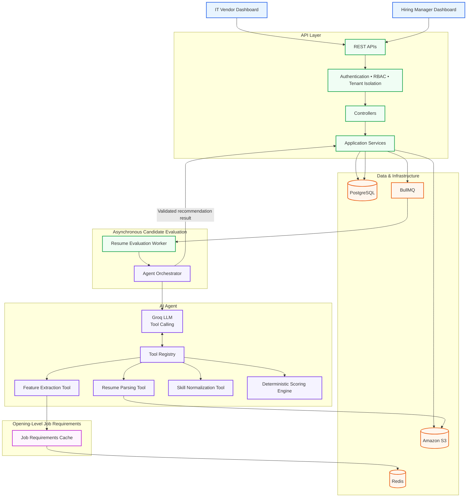

# Zelosify Contract Hiring Platform

## Overview

This repository contains a full-stack contract hiring module built around two personas:

- **IT Vendor** — views contract openings, uploads candidate profiles, previews files, and soft-deletes submissions.
- **Hiring Manager** — creates and manages openings, reviews submitted profiles, and shortlists or rejects candidates.

The backend is a TypeScript/Express service with PostgreSQL (Prisma), Keycloak authentication, S3-backed file storage, and a Groq-based LLM agent for candidate evaluation. The frontend is a Next.js App Router application with role-based routing and dark mode.

## System Architecture



## Repository Layout

```
.
├── Zelosify-Backend/
│   └── Server/                    # Express API server
│       ├── src/                   # Controllers, services, routers, workers, AI agent
│       ├── prisma/                # Prisma schema + migrations
│       ├── src/scripts/           # Seed scripts
│       └── tests/                 # Unit tests
├── Zelosify-Frontend/             # Next.js frontend
│   ├── src/app/                   # App Router pages (landing, auth, dashboards)
│   ├── src/components/            # Shared UI components
│   ├── src/hooks/                 # Hooks (auth, dashboard, UI)
│   ├── src/redux/                 # Redux Toolkit store + slices
│   └── src/utils/                 # API clients, auth utilities, common helpers
└── .env.example                   # Backend environment variables
```

## Backend (Zelosify-Backend/Server)

### Stack

- **Language**: TypeScript (ES modules), compiled with `tsc`
- **Framework**: Express 4
- **Database**: PostgreSQL 17, accessed through Prisma ORM
- **Auth**: Keycloak (OIDC RS256 JWT verification via JWKS), express-session with in-memory store
- **Storage**: AWS S3 (presigned URLs, direct browser upload)
- **Queues**: BullMQ with Redis for asynchronous AI processing
- **AI**: Groq SDK (tool-calling agent, deterministic scoring engine)
- **Caching**: In-memory user cache (5 min TTL), JWKS cache (24 h), Redis job-requirement cache (7 days default)
- **Security**: Helmet, CORS, role-based authorization middleware, tenant filtering in queries

### Architecture

```
Controller  ->  Service  ->  Prisma / S3 / Redis / BullMQ
                                      |
                                      +-> Groq agent -> Tool Registry
                                            -> Resume Parsing Tool
                                            -> Feature Extraction Tool
                                            -> Skill Normalization Tool
                                            -> Deterministic Scoring Engine
```

Controllers contain no business logic; services enforce validation and tenant isolation. All writes that must be atomic use Prisma transactions.

### Authentication & Authorization

- `authenticateUser` middleware verifies RS256 JWTs against the Keycloak JWKS endpoint, caches decoded users for 5 minutes, and attaches the user to `req.user`.
- `authorizeRole("IT_VENDOR" | "HIRING_MANAGER")` enforces role checks at the API layer.
- Tenant isolation is enforced by querying with `tenantId` on every opening/profile operation; cross-tenant access returns 404.
- Non-production builds accept `mock-vendor-token` / `mock-hm-token` or `x-mock-role` for local development.
- Local auth routes also exist for register / verify-login / verify-totp / logout.

### Tenant Isolation

Every opening/profile query is scoped to the authenticated user's tenant (`tenantId` from `req.user`). The seeded tenant is **"Bruce Wayne Corp"**, with all 12 seed openings owned by the seeded hiring manager in that same tenant.

### Storage & Uploads

- Profile files are stored as `s3://<bucket>/<tenantId>/<openingId>/<timestamp>_<filename>`.
- Vendor uploads are direct browser-to-S3 via presigned PUT URLs (10 MB limit, PDF only).
- Preview URLs are presigned GET URLs generated after authorization checks.
- Profile records are created in a Prisma transaction after the S3 upload completes.

### AI Recommendation Agent

- `AgentOrchestrator` is a real tool-calling Groq agent that decides when to invoke tools: `parse_resume`, `extract_features`, `normalize_skills`, and `deterministic_scoring`.
- Resume parsing runs through `ResumeParsingTool` (PDF/PPTX extraction, sanitization, Zod schema validation).
- Feature extraction (`FeatureExtractionTool`) extracts job requirements and is **cached in Redis** keyed by a SHA-256 hash of opening title + description, so repeated profiles for the same opening do not re-invoke the LLM.
- Skill normalization (`SkillNormalizationTool`) matches candidate skills against required skills.
- Scoring (`DeterministicScoringEngine`) is **deterministic and never computed by the LLM**:
  - Skill match: overlap / required skills
  - Experience: 0 below minimum, 1 in range, 0.8 above max
  - Location: 1 for remote/exact match, 0.5 otherwise
  - Final: `0.5 * skill + 0.3 * experience + 0.2 * location`
- Decisions: `RECOMMENDED >= 0.75`, `BORDERLINE >= 0.5`, else `NOT_RECOMMENDED`.
- Tool outputs are validated with Zod schemas before persistence. Resume content is sanitized before being sent to the LLM; retries exist for malformed outputs.
- Token usage, latency, and decision metadata are logged and persisted on the profile.

### Seeding

`src/scripts/seedOpenings.ts` seeds:

- Tenant: Bruce Wayne Corp
- Hiring manager: Bruce Wayne (`bwayne.hm@waynecorp.com`)
- IT vendor: Lucius Fox (`lucius.vendor@techpartners.com`)
- 12 contract openings across different roles, experience ranges, and contract types, all under the same tenant.

### Key Endpoints

**Vendor (`/api/v1/vendor`)**

- `GET /openings` — paginated, searchable openings for the vendor's tenant
- `GET /openings/:id` — opening details + active submitted profiles
- `POST /openings/:id/profiles/presign` — presigned upload URL
- `POST /openings/:id/profiles/upload` — submit profile metadata (Prisma transaction)
- `DELETE /profiles/:id` — soft delete profile
- `GET /profiles/:id/preview` — presigned preview URL

**Hiring Manager (`/api/v1/hiring-manager`)**

- `GET /openings` — openings owned by the authenticated manager
- `POST /openings` — create an opening
- `GET /openings/:id/profiles` — profiles for an owned opening (with AI fields)
- `PATCH /openings/:id/status` — OPEN / ON_HOLD / CLOSED
- `POST /profiles/:id/shortlist`
- `POST /profiles/:id/reject`
- `GET /profiles/:id/preview`

**Auth (`/api/v1/auth`)**

- `POST /register`, `POST /verify-login`, `POST /verify-totp`, `POST /logout`, `GET /user`

**Storage (`/api/v1/aws`)**

- `GET /list` — list S3 objects (authenticated)

### Async Processing

`resumeQueue.ts` / `resumeWorker.ts` use BullMQ to process each submitted profile asynchronously. The worker fetches the profile + opening, runs `AgentOrchestrator.evaluateCandidate`, and atomically writes the recommendation result back to the profile.

## Frontend (Zelosify-Frontend)

### Stack

- **Framework**: Next.js 15 (App Router), React 19
- **UI**: Tailwind CSS + shadcn/ui components
- **State**: Redux Toolkit (`@reduxjs/toolkit` + `react-redux`) for auth state
- **API**: Axios with `withCredentials` for cookie-based auth
- **Theme**: `next-themes` with light/dark system theme support
- **File handling**: `react-dropzone`-style drag-and-drop upload (implemented inline)
- **Icons**: Lucide React

### Routes

- `/` — landing page
- `/login`, `/register`, `/setup-totp` — auth pages
- `/vendor/openings`, `/vendor/openings/:id` — IT vendor dashboards
- `/hiring-manager/openings`, `/hiring-manager/openings/:id` — hiring manager dashboards
- `/user`, `/business-user/digital-initiative` — other role dashboards

### Vendor UI

- Openings table with search, status filter, pagination, hiring manager name, profile counts
- Opening detail: drag-and-drop batch PDF upload (multiple files, 10 MB limit, sequential processing with per-file status), preview modal, soft-delete confirmation
- Openings only accept submissions when status is OPEN

### Hiring Manager UI

- Openings table with search, status filter, pagination, create-opening modal, status dropdown
- Opening detail: candidate profile cards with AI recommendation badge, score %, confidence %, latency, reasoning text, PDF preview modal, shortlist/reject buttons

### Auth Flow

- Login/register pages call the backend auth endpoints.
- JWTs are stored in cookies (`access_token`, `refresh_token`); the middleware extracts the role from the access token and sets a `role` cookie for client-side routing.
- `middleware.js` protects `/vendor/*`, `/hiring-manager/*`, `/user/*`, `/business-user/*` and redirects unauthenticated users to `/login`.

## Running Locally

### Backend

1. Copy `.env.example` to `.env` and fill in the values.
2. `cd Zelosify-Backend/Server`
3. `npm install`
4. `npm run prisma:migrate` (or `npm run prisma:deploy` in production)
5. `npm run seed` (seed script is run via `npx tsx src/scripts/seedOpenings.ts`)
6. `npm run dev` (nodemon + tsx) or `npm run build && npm start`

### Frontend

1. `cd Zelosify-Frontend`
2. `npm install`
3. Create `.env` with `NEXT_PUBLIC_BACKEND_URL=http://localhost:5000`
4. `npm run dev` (runs on port 5173)
